# MedFlow - System Zarządzania Przychodnią

System zarządzania przychodnią medyczną usprawniający pracę personelu medycznego i ułatwiający pacjentom dostęp do opieki zdrowotnej.

##  Spis treści
- [Technologie](#technologie)
- [Architektura](#architektura)
- [Diagram ERD](#diagram-erd)
- [Instalacja i uruchomienie](#instalacja-i-uruchomienie)
- [Scenariusze testowe](#scenariusze-testowe)
- [Screeny aplikacji](#screeny-aplikacji)
- [Checklista funkcjonalności](#checklista-funkcjonalności)

##  Technologie

- **Backend**: PHP 8.3 (OOP, MVC)
- **Baza danych**: PostgreSQL 16
- **Serwer WWW**: Nginx 1.25
- **Frontend**: HTML5, CSS3, JavaScript (Fetch API)
- **Konteneryzacja**: Docker & Docker Compose
- **Kontrola wersji**: Git

##  Architektura

### Diagram warstwowy

```
┌─────────────────────────────────────────┐
│          WARSTWA PREZENTACJI            │
│  (HTML, CSS, JavaScript - Fetch API)    │
└─────────────────────────────────────────┘
                    
┌─────────────────────────────────────────┐
│         WARSTWA KONTROLERÓW             │
│    (SecurityController, Dashboard,      │
│   Appointment, Doctor, Patient)         │
└─────────────────────────────────────────┘
                    
┌─────────────────────────────────────────┐
│          WARSTWA SERWISÓW               │
│  (AuthService, AppointmentService,      │
│   ValidationService, SessionManager)    │
└─────────────────────────────────────────┘
                    
┌─────────────────────────────────────────┐
│        WARSTWA REPOZYTORIÓW             │
│  (UserRepository, AppointmentRepository,│
│   DoctorRepository, PatientRepository)  │
└─────────────────────────────────────────┘
                    
┌─────────────────────────────────────────┐
│            WARSTWA MODELI               │
│  (User, Patient, Doctor, Appointment,   │
│        MedicalRecord, Role)             │
└─────────────────────────────────────────┘
                    
┌─────────────────────────────────────────┐
│          BAZA DANYCH (PostgreSQL)       │
└─────────────────────────────────────────┘
```

### Zasady architektury:
- **MVC (Model-View-Controller)** - separacja logiki biznesowej od prezentacji
- **Repository Pattern** - warstwa abstrakcji dla dostępu do danych
- **Service Layer** - logika biznesowa oddzielona od kontrolerów
- **Dependency Injection** - luźne powiązania między komponentami
- **SOLID Principles** - Single Responsibility, Open/Closed, Liskov Substitution, Interface Segregation, Dependency Inversion

##  Diagram ERD

### Diagram relacji bazy danych
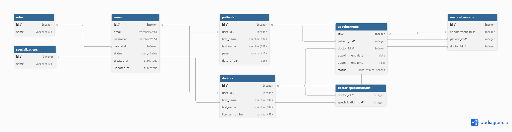
https://drive.google.com/file/d/1_bj3aqBQgx50xFx-YGex3YELmuGB02e3/view?usp=sharing


### Typy relacji:

#### Relacje 1:1 (jeden-do-jednego)
- `users` ↔ `patients` - jeden użytkownik może być jednym pacjentem
- `users` ↔ `doctors` - jeden użytkownik może być jednym lekarzem  
- `appointments` ↔ `medical_records` - jedna wizyta ma jedną dokumentację medyczną

#### Relacje 1:N (jeden-do-wielu)
- `roles` → `users` - jedna rola może mieć wielu użytkowników
- `patients` → `appointments` - jeden pacjent może mieć wiele wizyt
- `doctors` → `appointments` - jeden lekarz może mieć wiele wizyt
- `patients` → `medical_records` - jeden pacjent może mieć wiele rekordów medycznych
- `doctors` → `medical_records` - jeden lekarz może tworzyć wiele rekordów

#### Relacje N:M (wiele-do-wielu)
- `doctors` ↔ `specializations` (przez `doctor_specializations`)
  - wielu lekarzy może mieć wiele specjalizacji
  - wiele specjalizacji może być przypisanych do wielu lekarzy

### Główne tabele:

**users** - użytkownicy systemu
- id, email, password, role_id, status, created_at, updated_at, last_login

**patients** - dane pacjentów
- id, user_id, first_name, last_name, pesel, date_of_birth, phone, address, city, postal_code

**doctors** - dane lekarzy
- id, user_id, first_name, last_name, title, license_number, phone, bio

**appointments** - wizyty medyczne
- id, patient_id, doctor_id, appointment_date, appointment_time, duration, type, status, reason, notes

**medical_records** - dokumentacja medyczna
- id, appointment_id, patient_id, doctor_id, diagnosis_icd10, diagnosis_description, symptoms, treatment, prescription, recommendations

**roles** - role użytkowników
- id, name, description (admin, doctor, receptionist, patient)

**specializations** - specjalizacje medyczne
- id, name, description

### Widoki bazy danych:

1. **v_doctor_appointments** - wizyty lekarzy z danymi pacjentów
2. **v_patient_medical_history** - historia medyczna pacjentów
3. **v_daily_schedule** - dzienny grafik wizyt
4. **v_doctor_statistics** - statystyki lekarzy
5. **v_available_slots** - dostępne terminy wizyt

### Wyzwalacze (Triggers):

1. **update_updated_at** - automatyczna aktualizacja timestamp'ów
2. **prevent_appointment_overlap** - zapobieganie nakładaniu się wizyt
3. **create_medical_record_on_complete** - automatyczne tworzenie dokumentacji po wizycie

### Funkcje:

1. **get_patient_age()** - obliczanie wieku pacjenta
2. **get_doctor_upcoming_appointments()** - liczba nadchodzących wizyt lekarza
3. **is_slot_available()** - sprawdzanie dostępności terminu
4. **get_patient_last_visit()** - ostatnia wizyta pacjenta
5. **cancel_appointment()** - anulowanie wizyty
6. **get_appointments_by_date_range()** - wizyty w zakresie dat

##  Instalacja i uruchomienie

### Wymagania:
- Docker Desktop
- Git

Zawartość `.env.example`:
```env
# Database Configuration
DB_HOST=db
DB_PORT=5432
DB_NAME=medflow_db
DB_USER=medflow_user
DB_PASSWORD=medflow_pass

# Application Configuration
APP_ENV=development
APP_DEBUG=true
APP_URL=http://localhost:8080

# Session Configuration
SESSION_LIFETIME=3600
```

Baza danych jest automatycznie inicjalizowana przy pierwszym uruchomieniu.
Skrypty SQL są wykonywane w kolejności:
1. `01_init.sql` - struktura tabel
2. `02_seed.sql` - dane testowe
3. `03_views.sql` - widoki
4. `04_triggers.sql` - wyzwalacze
5. `05_functions.sql` - funkcje

### Dostęp do aplikacji:

- **Aplikacja**: http://localhost:8080
- **pgAdmin**: http://localhost:5050
  - Email: admin@medflow.com
  - Hasło: admin

### Konta testowe:

| Email | Hasło | Rola |
|-------|-------|------|
| admin@medflow.com | password | Administrator |
| jan.kowalski@medflow.com | password | Lekarz (Kardiologia) |
| anna.nowak@medflow.com | password | Lekarz (Dermatologia) |
| recepcja@medflow.com | password | Recepcja |
| pacjent1@example.com | password | Pacjent |

### Restart aplikacji:
```bash
docker-compose restart
```

##  Scenariusze testowe

### Test 1: Logowanie i autoryzacja

#### Krok 1: Test logowania pacjenta
1. Otwórz http://localhost:8080
2. Zaloguj się jako pacjent: `pacjent1@example.com` / `password`
3. **Oczekiwany rezultat**: Przekierowanie do dashboardu pacjenta

#### Krok 2: Test błędu 401 (Unauthorized)
1. Wyloguj się
2. Spróbuj wejść bezpośrednio na: http://localhost:8080/patient-dashboard
3.  **Oczekiwany rezultat**: Przekierowanie do strony logowania

#### Krok 3: Test błędu 403 (Forbidden)
1. Zaloguj się jako pacjent
2. Spróbuj wejść na: http://localhost:8080/doctors-list
3.  **Oczekiwany rezultat**: Strona "403 - Brak dostępu"

### Test 2: Role użytkowników

#### Administrator (admin@medflow.com)
1. Zaloguj się jako admin
2. Sprawdź dostęp do:
   -  Panel administratora
   -  Lista lekarzy
   -  Lista pacjentów
   -  Statystyki systemu

#### Lekarz (jan.kowalski@medflow.com)
1. Zaloguj się jako lekarz
2. Sprawdź dostęp do:
   -  Panel lekarza z dzisiejszymi wizytami
   -  Lista nadchodzących wizyt
   -  Statystyki (zakończone, nadchodzące)
   -  Historia pacjentów

#### Recepcja (recepcja@medflow.com)
1. Zaloguj się jako recepcja
2. Sprawdź dostęp do:
   -  Panel recepcji
   -  Wizyty dzisiaj
   -  Wizyty w tym tygodniu
   -  Kalendarz wizyt

#### Pacjent (pacjent1@example.com)
1. Zaloguj się jako pacjent
2. Sprawdź dostęp do:
   -  Panel pacjenta
   -  Umawianie wizyt
   -  Historia wizyt
   -  Dokumentacja medyczna

### Test 3: CRUD - Wizyty (Appointment)

#### CREATE - Umawianie wizyty
1. Zaloguj się jako pacjent: `pacjent1@example.com`
2. Kliknij "Umów wizytę"
3. Wybierz lekarza: "dr n. med. Jan Kowalski"
4. Wybierz datę: jutrzejsza data
5. Wybierz godzinę z dostępnych slotów
6. Typ: NFZ
7. Powód: "Kontrola"
8. Kliknij "Umów wizytę"
9.  **Oczekiwany rezultat**: Wizyta utworzona, komunikat sukcesu

**Weryfikacja w bazie:**
```sql
SELECT * FROM appointments WHERE patient_id = 1 ORDER BY id DESC LIMIT 1;
```

#### READ - Przeglądanie wizyt
1. Przejdź do "Moje wizyty"
2.  **Oczekiwany rezultat**: Lista nadchodzących wizyt
3. Sprawdź filtry: "Nadchodzące", "Przeszłe", "Wszystkie"

#### UPDATE - Zmiana statusu (przez lekarza)
1. Wyloguj się
2. Zaloguj się jako lekarz: `jan.kowalski@medflow.com`
3. Na dashboardu znajdź wizytę
4. Kliknij "Potwierdź" lub "Zakończ"
5.  **Oczekiwany rezultat**: Status zmieniony

**Weryfikacja w bazie:**
```sql
SELECT id, status FROM appointments WHERE id = [APPOINTMENT_ID];
```

#### DELETE - Anulowanie wizyty
1. Zaloguj się jako pacjent
2. Przejdź do "Moje wizyty"
3. Kliknij "Anuluj" przy wybranej wizycie
4. Potwierdź anulowanie
5.  **Oczekiwany rezultat**: Status zmieniony na "cancelled"

**Weryfikacja w bazie:**
```sql
SELECT id, status FROM appointments WHERE status = 'cancelled';
```

### Test 4: Widoki bazy danych

#### Test widoku v_doctor_appointments
```sql
SELECT * FROM v_doctor_appointments WHERE doctor_id = 1 LIMIT 5;
```
 **Oczekiwany rezultat**: Lista wizyt lekarza z danymi pacjentów

#### Test widoku v_patient_medical_history
```sql
SELECT * FROM v_patient_medical_history WHERE patient_id = 1;
```
 **Oczekiwany rezultat**: Historia medyczna pacjenta z diagnozami

#### Test widoku v_daily_schedule
```sql
SELECT * FROM v_daily_schedule WHERE appointment_date = CURRENT_DATE;
```
 **Oczekiwany rezultat**: Grafik na dzisiaj

#### Test widoku v_available_slots
```sql
SELECT * FROM v_available_slots WHERE doctor_id = 1 AND available_date = CURRENT_DATE + 1;
```
 **Oczekiwany rezultat**: Dostępne terminy na jutro

### Test 5: Wyzwalacze (Triggers)

#### Test wyzwalacza update_updated_at
```sql
-- Przed aktualizacją
SELECT id, updated_at FROM users WHERE id = 1;

-- Aktualizacja
UPDATE users SET status = 'active' WHERE id = 1;

-- Po aktualizacji
SELECT id, updated_at FROM users WHERE id = 1;
```
 **Oczekiwany rezultat**: Pole `updated_at` automatycznie zaktualizowane

#### Test wyzwalacza prevent_appointment_overlap
```sql
-- Próba dodania nakładającej się wizyty
INSERT INTO appointments (patient_id, doctor_id, appointment_date, appointment_time, duration, type, status) 
VALUES (2, 1, '2025-12-30', '09:00:00', 30, 'nfz', 'scheduled');
```
 **Oczekiwany rezultat**: Błąd "Doctor already has an appointment at this time"

#### Test wyzwalacza create_medical_record_on_complete
```sql
-- Zmiana statusu wizyty na completed
UPDATE appointments SET status = 'completed' WHERE id = 1;

-- Sprawdzenie czy został utworzony rekord medyczny
SELECT * FROM medical_records WHERE appointment_id = 1;
```
 **Oczekiwany rezultat**: Automatycznie utworzony pusty rekord medyczny

### Test 6: Funkcje bazy danych

#### Test funkcji get_patient_age
```sql
SELECT get_patient_age(1);
```
 **Oczekiwany rezultat**: Wiek pacjenta w latach

#### Test funkcji is_slot_available
```sql
SELECT is_slot_available(1, '2025-12-30', '14:00:00');
```
 **Oczekiwany rezultat**: `true` lub `false`

#### Test funkcji get_patient_last_visit
```sql
SELECT * FROM get_patient_last_visit(1);
```
 **Oczekiwany rezultat**: Data ostatniej wizyty, lekarz, diagnoza

#### Test funkcji cancel_appointment
```sql
SELECT cancel_appointment(3);
```
 **Oczekiwany rezultat**: `true` jeśli anulowano, `false` jeśli nie

### Test 7: Walidacja i błędy

#### Test walidacji PESEL
1. Próba rejestracji z nieprawidłowym PESEL: `12345678901`
2.  **Oczekiwany rezultat**: Błąd "Invalid PESEL checksum"

#### Test walidacji email
1. Próba rejestracji z błędnym emailem: `invalid.email`
2.  **Oczekiwany rezultat**: Błąd "Invalid email format"

#### Test strony 404
1. Wejdź na: http://localhost:8080/nieistniejaca-strona
2.  **Oczekiwany rezultat**: Strona "404 - Nie znaleziono"

#### Test strony 500
1. Symulacja błędu serwera (np. błąd w SQL)
2.  **Oczekiwany rezultat**: Strona "500 - Błąd serwera"

### Test 8: Responsywność

1. Otwórz aplikację w przeglądarce
2. Zmień rozmiar okna (lub użyj narzędzi deweloperskich)
3. Testuj na różnych rozdzielczościach:
   - Desktop: 1920x1080
   - Tablet: 768x1024
   - Mobile: 375x667
4.  **Oczekiwany rezultat**: Layout dostosowuje się do rozmiaru ekranu

### Test 9: Testy jednostkowe

```bash
# Wszystkie testy
docker exec -it medflow-php-1 php /app/tests/run_tests.php

# Pojedyncze testy
docker exec -it medflow-php-1 php /app/tests/unit/ValidationServiceTest.php
docker exec -it medflow-php-1 php /app/tests/unit/UserTest.php
docker exec -it medflow-php-1 php /app/tests/unit/AppointmentTest.php
docker exec -it medflow-php-1 php /app/tests/integration/AuthenticationIntegrationTest.php
```

 **Oczekiwany rezultat**: 
```
All tests passed successfully!
Total test suites: 4
Passed: 4
Failed: 0
```

## Screeny aplikacji

### 1. Strona logowania
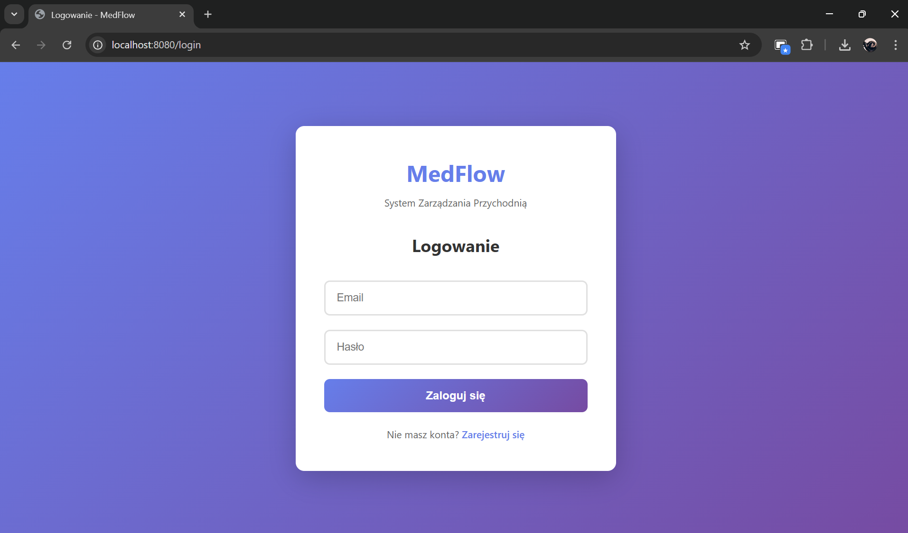
- Formularz logowania
- Link do rejestracji
- Konta testowe

### 2. Rejestracja pacjenta
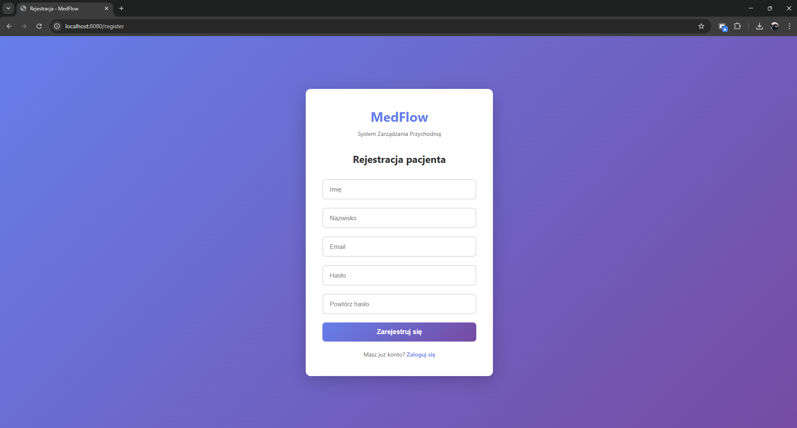
- Formularz rejestracji
- Walidacja danych

### 3. Dashboard Pacjenta
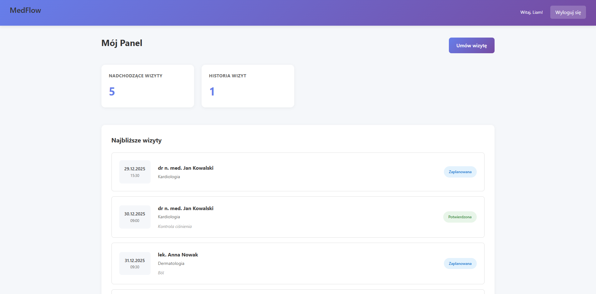
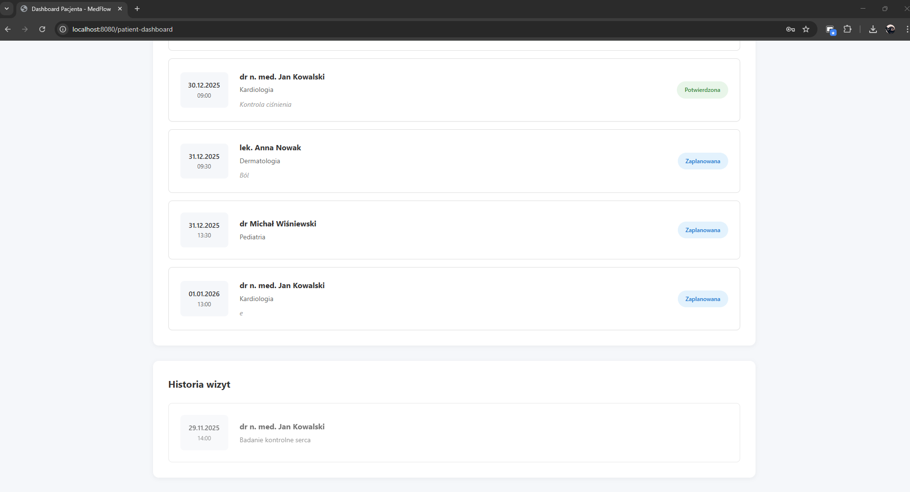
- Nadchodzące wizyty
- Historia wizyt
- Przycisk "Umów wizytę"

### 4. Umawianie wizyty
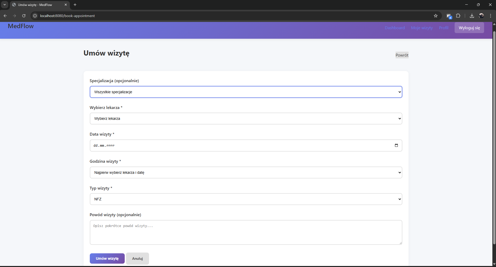
- Wybór lekarza i specjalizacji
- Wybór daty i godziny
- Dostępne terminy

### 5. Dashboard Lekarza
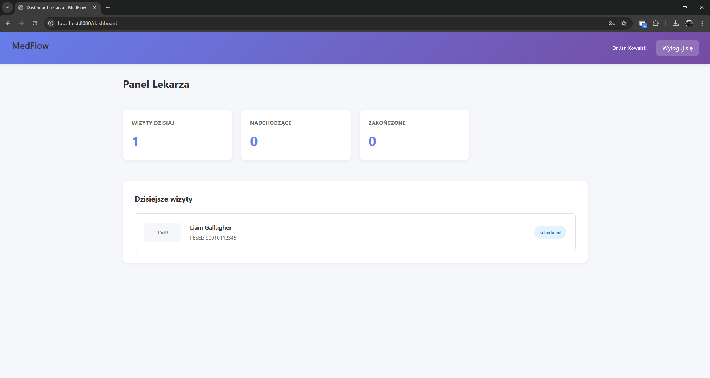
- Dzisiejsze wizyty
- Statystyki (nadchodzące, zakończone)
- Lista pacjentów

### 6. Dashboard Recepcji
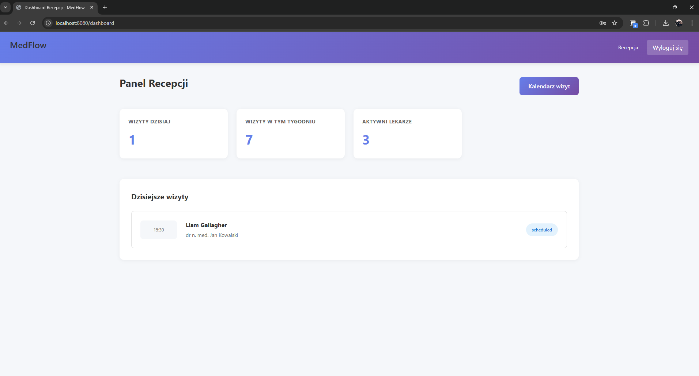
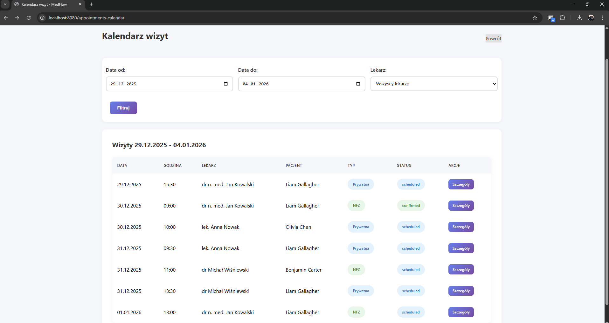
- Wizyty dzisiaj
- Wizyty w tym tygodniu
- Kalendarz

### 7. Strona błędu 404
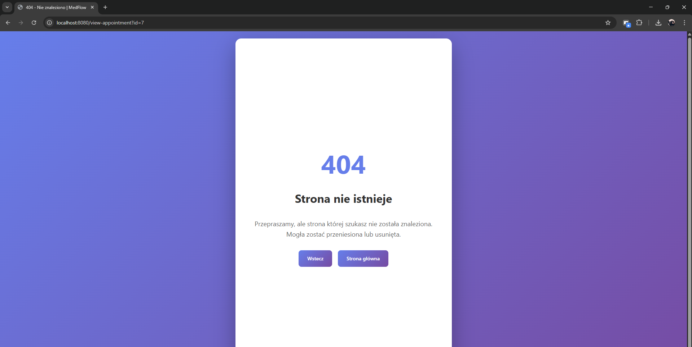

### 8. Responsywność - Mobile
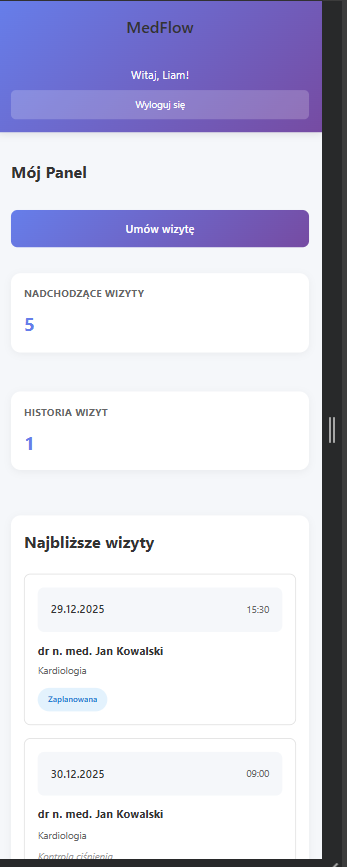

##  Checklista funkcjonalności

### Wymagania obowiązkowe

#### Technologie
- [x] Docker
- [x] Git (repozytorium publiczne)
- [x] HTML5
- [x] CSS3
- [x] JavaScript (Fetch API)
- [x] PHP 8.3 (obiektowy)
- [x] PostgreSQL 16
- [x] Nginx
- [x] Brak frameworków i gotowych szablonów

#### Architektura
- [x] MVC (Model-View-Controller)
- [x] Repository Pattern
- [x] Service Layer
- [x] Separacja frontend-backend
- [x] Zasady SOLID
- [x] Zasady OOP (enkapsulacja, dziedziczenie, polimorfizm)

#### Design
- [x] Estetyczny interfejs
- [x] Responsywność (CSS Media Queries)
- [x] Spójny design system
- [x] Gradient backgrounds
- [x] Animacje i transitions

#### Funkcjonalności
- [x] Proces logowania
- [x] Rejestracja użytkowników
- [x] Utrzymanie sesji
- [x] 4 role użytkowników (admin, doctor, receptionist, patient)
- [x] Weryfikacja uprawnień
- [x] Zarządzanie użytkownikami
- [x] Wylogowanie
- [x] Dashboard dla każdej roli
- [x] CRUD wizyt (Create, Read, Update, Delete)
- [x] Umawianie wizyt online
- [x] Kalendarz wizyt
- [x] Historia medyczna
- [x] Profile użytkowników

#### Baza danych - Struktura
- [x] Relacje 1:1 (users-patients, users-doctors, appointments-medical_records)
- [x] Relacje 1:N (roles-users, patients-appointments, doctors-appointments)
- [x] Relacje N:M (doctors-specializations)
- [x] Klucze główne i obce
- [x] ON DELETE CASCADE / RESTRICT
- [x] Constraints (CHECK, UNIQUE)
- [x] Typy ENUM
- [x] Indeksy na kluczowych polach

#### Baza danych - Widoki
- [x] v_doctor_appointments (JOIN doctors, users, appointments, patients)
- [x] v_patient_medical_history (JOIN patients, appointments, doctors, medical_records, specializations)
- [x] v_daily_schedule (JOIN appointments, doctors, patients, specializations)
- [x] v_doctor_statistics (agregacje GROUP BY)
- [x] v_available_slots (CROSS JOIN z generate_series)

#### Baza danych - Wyzwalacze
- [x] update_updated_at (aktualizacja timestampów)
- [x] prevent_appointment_overlap (sprawdzanie kolizji)
- [x] create_medical_record_on_complete (automatyczne tworzenie rekordów)

#### Baza danych - Funkcje
- [x] get_patient_age() - obliczanie wieku
- [x] get_doctor_upcoming_appointments() - liczba wizyt
- [x] is_slot_available() - sprawdzanie dostępności
- [x] get_patient_last_visit() - ostatnia wizyta
- [x] cancel_appointment() - anulowanie
- [x] get_appointments_by_date_range() - zakres dat

#### Baza danych - Transakcje
- [x] Użycie transakcji (beginTransaction, commit, rollback)
- [x] Poziom izolacji (ustawiony w Database.php)
- [x] Rollback przy błędach

#### Baza danych - Normalizacja
- [x] 1NF (atomowe wartości)
- [x] 2NF (brak zależności częściowych)
- [x] 3NF (brak zależności przechodnich)
- [x] Brak redundancji danych
- [x] Brak anomalii modyfikacji i usuwania

#### Zabezpieczenia
- [x] Password hashing (bcrypt)
- [x] Session management
- [x] SQL injection protection (prepared statements)
- [x] XSS protection (htmlspecialchars)
- [x] CSRF protection (session validation)
- [x] Input validation i sanitization
- [x] Role-based access control

#### Obsługa błędów
- [x] ErrorHandler.php (globalny handler)
- [x] Strona 400 (Bad Request)
- [x] Strona 403 (Forbidden)
- [x] Strona 404 (Not Found)
- [x] Strona 500 (Internal Server Error)
- [x] Try-catch w kodzie
- [x] Error logging

#### Testy
- [x] Testy jednostkowe (ValidationServiceTest, UserTest, AppointmentTest)
- [x] Testy integracyjne (AuthenticationIntegrationTest)
- [x] Test runner (run_tests.php)
- [x] Bootstrap dla testów

#### Dokumentacja
- [x] README.md
- [x] Diagram ERD
- [x] Diagram architektury
- [x] Instrukcja uruchomienia
- [x] .env.example
- [x] Scenariusze testowe
- [x] Checklista
- [x] Screeny aplikacji
- [x] Komentarze w kodzie

#### Git
- [x] Repozytorium publiczne
- [x] Systematyczne commity
- [x] Opisowe commity
- [x] .gitignore

### Funkcjonalności dodatkowe

#### Backend
- [x] Walidacja PESEL (checksum)
- [x] Walidacja email (regex)
- [x] Walidacja dat i czasu
- [x] Flash messages
- [x] Paginacja (podstawy)
- [x] Wyszukiwanie pacjentów
- [x] Filtrowanie wizyt
- [x] Statystyki

#### Frontend
- [x] AJAX (Fetch API)
- [x] Dynamiczne ładowanie slotów
- [x] Animacje CSS
- [x] Loading indicators
- [x] Toast notifications
- [x] Potwierdzenia akcji (confirm dialogs)
- [x] Client-side validation
- [x] Password strength indicator
- [x] Auto-save drafts (localStorage)

#### UX/UI
- [x] Smooth scrolling
- [x] Tooltips
- [x] Breadcrumbs
- [x] Back to top button
- [x] Tab navigation
- [x] Alert auto-hide
- [x] Hover effects
- [x] Focus states

## Struktura projektu

```
medflow/
├── database/
│   ├── 01_init.sql           # Struktura tabel
│   ├── 02_seed.sql           # Dane testowe
│   ├── 03_views.sql          # Widoki
│   ├── 04_triggers.sql       # Wyzwalacze
│   └── 05_functions.sql      # Funkcje
├── docker/
│   ├── db/Dockerfile
│   ├── nginx/
│   │   ├── Dockerfile
│   │   └── nginx.conf
│   └── php/Dockerfile
├── public/
│   ├── scripts/
│   │   ├── api.js            # Fetch API wrapper
│   │   ├── appointments.js   # Logika wizyt
│   │   ├── forms.js          # Walidacja formularzy
│   │   ├── main.js           # Ogólne funkcje
│   │   └── search.js         # Wyszukiwanie
│   ├── styles/
│   │   ├── dashboard.css     # Style dashboardów
│   │   ├── login.css         # Style logowania
│   │   ├── main.css          # Główne style
│   │   ├── responsive-nav.css
│   │   └── responsive-tables.css
│   └── views/
│       ├── login.html
│       ├── register.html
│       ├── patient-dashboard.html
│       ├── doctor-dashboard.html
│       ├── admin-dashboard.html
│       ├── receptionist-dashboard.html
│       ├── book-appointment.html
│       └── errors/
│           ├── 400.html
│           ├── 403.html
│           ├── 404.html
│           └── 500.html
├── src/
│   ├── controllers/
│   │   ├── AppController.php
│   │   ├── SecurityController.php
│   │   ├── DashboardController.php
│   │   ├── AppointmentController.php
│   │   ├── DoctorController.php
│   │   └── PatientController.php
│   ├── models/
│   │   ├── User.php
│   │   ├── Patient.php
│   │   ├── Doctor.php
│   │   ├── Appointment.php
│   │   ├── MedicalRecord.php
│   │   └── Role.php
│   ├── repository/
│   │   ├── Database.php
│   │   ├── Repository.php
│   │   ├── UserRepository.php
│   │   ├── PatientRepository.php
│   │   ├── DoctorRepository.php
│   │   ├── AppointmentRepository.php
│   │   ├── MedicalRecordRepository.php
│   │   ├── RoleRepository.php
│   │   └── SpecializationRepository.php
│   └── services/
│       ├── AuthService.php
│       ├── AppointmentService.php
│       ├── ValidationService.php
│       ├── SessionManager.php
│       └── ErrorHandler.php
├── tests/
│   ├── bootstrap.php
│   ├── run_tests.php
│   ├── unit/
│   │   ├── ValidationServiceTest.php
│   │   ├── UserTest.php
│   │   └── AppointmentTest.php
│   └── integration/
│       └── AuthenticationIntegrationTest.php
├── docs/
│   ├── erd-diagram.png
│   ├── erd-diagram.drawio
│   ├── architecture.png
│   └── screenshots/
├── .env.example
├── .gitignore
├── docker-compose.yml
├── index.php
├── Routing.php
└── README.md
```
